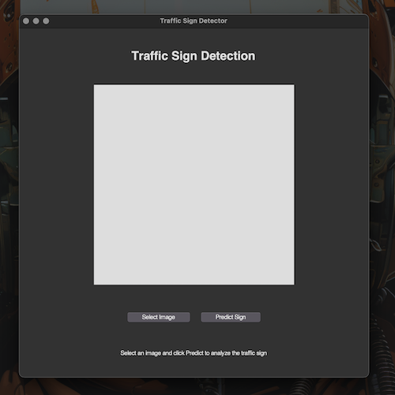
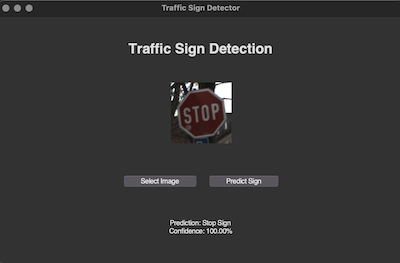

# Traffic Sign Detector Using Keras ⛔️

A deep learning project using Keras to detect traffic signs, specifically focusing on stop signs and traffic lights.

<div id="screenshots" align="center">



---
(GUI Interface with Image Selection)



</div>

## Features
- Real-time traffic sign detection
- Modern GUI interface
- Support for stop signs, traffic lights, and other traffic signs
- High accuracy predictions
- Easy-to-use interface

## Project Structure

- `src/`: Source code for the project
  - `train.py`: Script for training the model
  - `predict.py`: Script for making predictions
  - `gui.py`: Modern GUI application
  - `utils.py`: Utility functions
- `model/`: Directory for storing the trained model
- `data/`: Directory for storing the dataset
  - `train/`: Training data
  - `test/`: Test data
- `requirements.txt`: List of Python dependencies
- `README.md`: Project documentation

## Prerequisites
- Python 3.8 or higher
- pip package manager
- Virtual environment (recommended)

## Getting Started

1. Clone the repository:
```bash
git clone https://github.com/byrongomezjr/traffic_sign_detection.git
cd traffic_sign_detection
```

2. Create and activate virtual environment:
```bash
python -m venv venv
source venv/bin/activate  # On Windows: venv\Scripts\activate
```

3. Install the required dependencies:
```bash
pip install -r requirements.txt
```

## Dataset Setup

This project uses the [GTSRB - German Traffic Sign Recognition Benchmark](https://www.kaggle.com/datasets/meowmeowmeowmeowmeow/gtsrb-german-traffic-sign) dataset.

1. Download the dataset:
   - Visit [GTSRB Dataset on Kaggle](https://www.kaggle.com/datasets/meowmeowmeowmeowmeow/gtsrb-german-traffic-sign)
   - Download `archive.zip`

2. Prepare the dataset:
   - Create a `temp_data` directory in the project root
   - Place the downloaded `archive.zip` in `temp_data/`
   - Run: `python organize_dataset.py`

## Usage

1. Train the model:
```bash
python src/train.py
```

2. Make predictions using the GUI:
```bash
python src/gui.py
```

## Model Performance
- The model is trained specifically on three classes:
  - Stop signs
  - Traffic lights
  - Other traffic signs
- Achieves high accuracy on test data
- Fast prediction times

## Contributing
Pull requests are welcome. For major changes, please open an issue first to discuss what you would like to change.

## License
[MIT License](LICENSE)

## Author
Byron Gomez Jr.

## Acknowledgments
- [GTSRB Dataset](https://www.kaggle.com/datasets/meowmeowmeowmeowmeow/gtsrb-german-traffic-sign)
- [Keras Documentation](https://keras.io/)